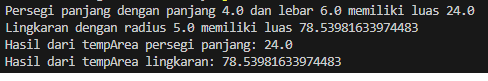

## Implementasi Pola Desain Proxy pada Domain Kasus Bangun Datar

# Deskripsi
Pola desain Proxy adalah salah satu pola desain struktural yang memungkinkan kita menyediakan pengganti atau placeholder untuk objek lain. Proxy mengontrol akses ke objek asli, sehingga memungkinkan kita melakukan sesuatu sebelum atau setelah permintaan diteruskan ke objek asli.

Dalam implementasi ini, kita akan menggunakan pola Proxy untuk mengelola objek-objek bangun datar, seperti lingkaran dan persegi panjang. Kita akan membuat proxy geometri untuk menghitung area dari objek-objek ini dan menyimpan hasilnya dalam cache untuk efisiensi.

# Contoh Hasil

